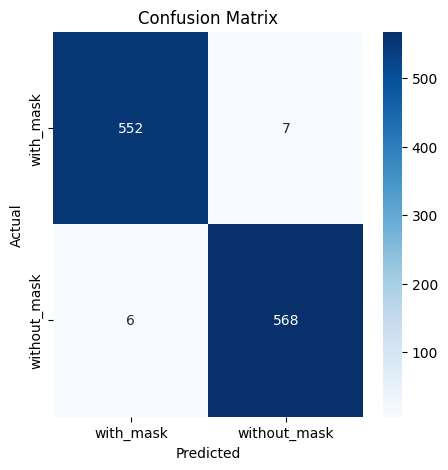
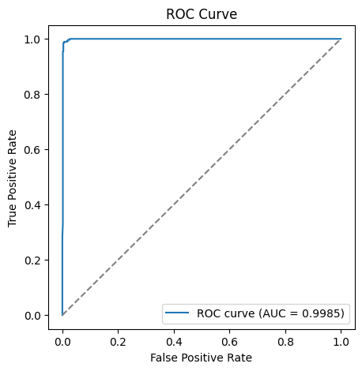
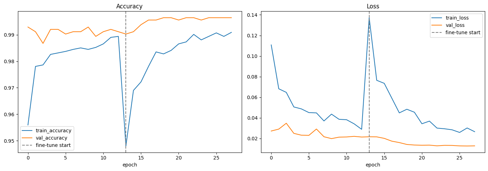
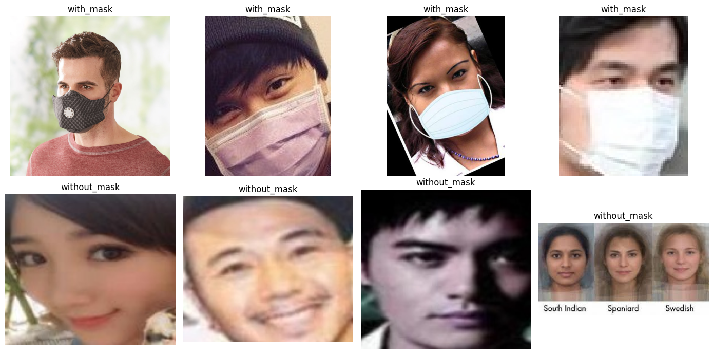

# 😷 Face Mask Detection

A deep learning project that classifies whether a person in an image is **wearing a face mask** or **not**, built with **TensorFlow/Keras** and **transfer learning (MobileNetV2)**.

Trained and evaluated on the [Face Mask Dataset](https://www.kaggle.com/datasets/omkargurav/face-mask-dataset) (7,553 images) — achieves **98.85% test accuracy** and a **0.9985 ROC-AUC**.

---

## ✨ Features

- **Transfer learning with MobileNetV2** (ImageNet-pretrained) instead of a CNN trained from scratch — better accuracy with less data and training time.
- **Two-phase training**: frozen-backbone warm-up followed by fine-tuning of the top backbone layers at a low learning rate.
- **`tf.data` input pipeline** for fast, memory-efficient loading (no need to hold the whole dataset in RAM).
- **On-the-fly data augmentation** (random flip, rotation, zoom, contrast) applied only to the training set.
- **Stratified 70/15/15 train/validation/test split** — no data leakage between sets.
- **Class-weighted loss** to handle any imbalance between the two classes.
- **Full evaluation suite**: accuracy, precision, recall, F1-score, confusion matrix, and ROC-AUC curve — not just raw accuracy.
- **Consistent preprocessing** between training and inference, so predictions on new images match what the model was trained on.
- **Single-image and live webcam inference** (webcam capture works in Google Colab).
- **Reproducible pipeline**: fixed random seeds for NumPy, TensorFlow, and Python's `random`.

---

## 🧠 Model Architecture

```
Input (128x128x3)
     │
MobileNetV2 (ImageNet weights, top ~30 layers fine-tuned)
     │
GlobalAveragePooling2D
     │
Dropout(0.3)
     │
Dense(128, relu)
     │
Dropout(0.2)
     │
Dense(1, sigmoid)  →  P(without_mask)
```

- **Total parameters:** 2,422,081
- **Trainable (phase 1, frozen backbone):** 164,097
- **Training strategy:**
  1. **Phase 1 — Head training:** backbone frozen, only the classification head trains (`lr = 1e-3`).
  2. **Phase 2 — Fine-tuning:** last ~30 layers of MobileNetV2 unfrozen, entire model trains at a much lower rate (`lr = 1e-5`).

Both phases use `EarlyStopping`, `ReduceLROnPlateau`, and `ModelCheckpoint` (best `val_loss` saved).

---

## 📊 Performance

Results from the held-out **test set (1,133 images, unseen during training/validation)**:

### Overall test set metrics

| Metric              | Score      |
|---------------------|------------|
| Accuracy            | **98.85%** |
| Precision            | 0.9878     |
| Recall               | 0.9895     |
| F1-score             | 0.9887     |
| ROC-AUC             | **0.9985** |

### Per-class report

| Class          | Precision | Recall | F1-score | Support |
|----------------|-----------|--------|----------|---------|
| with_mask      | 0.9892    | 0.9875 | 0.9884   | 559     |
| without_mask   | 0.9878    | 0.9895 | 0.9887   | 574     |
| **accuracy**   |           |        | **0.9885** | 1133  |
| macro avg      | 0.9885    | 0.9885 | 0.9885   | 1133    |
| weighted avg   | 0.9885    | 0.9885 | 0.9885   | 1133    |

### Confusion Matrix

|                     | Predicted: with_mask | Predicted: without_mask |
|---------------------|:---------------------:|:-------------------------:|
| **Actual: with_mask**    | 552 | 7   |
| **Actual: without_mask** | 6   | 568 |

Only **13 misclassifications out of 1,133** test images.



### ROC Curve



### Training curves (head training → fine-tuning)

Validation loss dropped from **0.0272** (end of head-training phase) to **0.0173** after fine-tuning, with validation accuracy staying above **99%** through most of training.



### Sample dataset images



### Sample inference

```python
detect_mask(sample_mask)     # -> with_mask     (confidence: 100.00%)
detect_mask(sample_no_mask)  # -> without_mask  (confidence: 99.76%)
```

---

## 📁 Project Structure

```
face-mask-detection/
├── mask_detection_improved.ipynb   # main notebook: data prep, training, evaluation, inference
├── mask_detector_final.keras       # saved trained model
├── assets/
│   ├── sample_images.png
│   ├── training_curves.png
│   ├── confusion_matrix.png
│   └── roc_curve.png
├── requirements.txt
└── README.md
```

---

## 🗂️ Dataset

[Face Mask Dataset](https://www.kaggle.com/datasets/omkargurav/face-mask-dataset) by Omkar Gurav (Kaggle):

| Class          | # Images |
|----------------|----------|
| with_mask      | 3,725    |
| without_mask   | 3,828    |
| **Total**      | **7,553** |

Split: **5,287 train / 1,133 validation / 1,133 test** (stratified 70/15/15).

Downloaded automatically in the notebook via [`kagglehub`](https://pypi.org/project/kagglehub/) — no manual download needed.

---

## ⚙️ Installation

```bash
git clone https://github.com/<your-username>/face-mask-detection.git
cd face-mask-detection
pip install -r requirements.txt
```

**`requirements.txt`:**
```
tensorflow>=2.15
opencv-python
numpy
matplotlib
seaborn
scikit-learn
kagglehub
```

---

## 🚀 Usage

### 1. Train the model
Open and run `mask_detection_improved.ipynb` top to bottom (Jupyter, JupyterLab, VS Code, or Google Colab). The dataset downloads automatically, and the trained model is saved as `mask_detector_final.keras`.

### 2. Run inference on a single image
```python
from tensorflow.keras.models import load_model
model = load_model("mask_detector_final.keras")

detect_mask("path/to/image.jpg", model=model)
# -> "with_mask  (confidence: 97.32%)"
```

### 3. Live webcam detection
Run the webcam cells at the end of the notebook (Google Colab only — uses the browser's camera API).

---

## 🔮 Future Improvements

- [ ] Add real-time **face detection** (e.g. MTCNN, Haar cascade, or MediaPipe) before classification, to support multi-face images and full video streams rather than single pre-cropped faces.
- [ ] Export to **TensorFlow Lite / ONNX** for mobile and edge deployment.
- [ ] Add a **Grad-CAM** visualization to explain what the model is focusing on.
- [ ] Package a simple **Streamlit/Gradio demo app**.
- [ ] Expand to a 3rd class for **incorrectly worn masks**.
- [ ] Add **CI** (GitHub Actions) to run a smoke test of the training pipeline on a small data subset.

---

## 🛠️ Tech Stack

- Python, TensorFlow / Keras
- OpenCV
- scikit-learn
- NumPy, Matplotlib, Seaborn
- kagglehub

---

## 📄 License

This project is released under the [MIT License](LICENSE). The dataset itself follows the license terms set by its Kaggle publisher.

---

## 🙌 Acknowledgements

- Dataset: [Omkar Gurav — Face Mask Dataset](https://www.kaggle.com/datasets/omkargurav/face-mask-dataset)
- Base model: [MobileNetV2](https://arxiv.org/abs/1801.04381) (Sandler et al., 2018)
